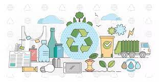

<h1>API RECICLAJE</h1>

<h2>¿QUE ES?</H2>

Es una aplicacion orientada a la concientizacion y ayuda en el reciclaje de los materiales

<h2>COMPONENTES</h2>
<a href="https://github.com/seleluciano/Reciclaje/blob/main/Proyectodjango/appreciclaje/urls.py">URLS</a> 
<a href="https://github.com/seleluciano/Reciclaje/blob/main/Proyectodjango/appreciclaje/views.py">VIEW EN DJANGO</a>

Todos los componentes heredan de una clase Padre
<a href="https://github.com/seleluciano/Reciclaje/blob/main/Proyectodjango/appreciclaje/templates/padre.html">HTML PADRE</a>
<ul>
<li><a href="https://github.com/seleluciano/Reciclaje/blob/main/Proyectodjango/appreciclaje/templates/index.html ">INICIO</a></li>
<li><a href="https://github.com/seleluciano/Reciclaje/blob/main/Proyectodjango/appreciclaje/templates/iniciosesion.html ">INICIAR SESION</a></li>
<li><a href="https://github.com/seleluciano/Reciclaje/blob/main/Proyectodjango/appreciclaje/templates/registrarusuario.html ">REGISTRAR USUARIO</a></li>
<li><a href="https://github.com/seleluciano/Reciclaje/blob/main/Proyectodjango/appreciclaje/templates/concientizacion.html ">CONCIENTIZACION</a></li>
<li><a href="https://github.com/seleluciano/Reciclaje/blob/main/Proyectodjango/appreciclaje/templates/contacto.html ">CONTACTO</a></li>
</ul>

<h2>MODELOS</h2>
<h3>CLIENTE</h3>

Es el usuario que navegara en la pagina pero no tendra permiso para modificar la base de datos

<h3>ADMINISTRADOR</h3>

Es el usuario que podra navegar por la base de datos y ademas podra modificar la base de datos creando, modificando o eliminando tablas 

<h3>OBJETO</h3>

Seria el material a reciclar para poder ayudar a los CLientes en el reciclaje

<a href="https://github.com/seleluciano/Reciclaje/blob/main/Proyectodjango/appreciclaje/models.py">Ingrese aqui para ver las propiedades de cada modelo</a>
